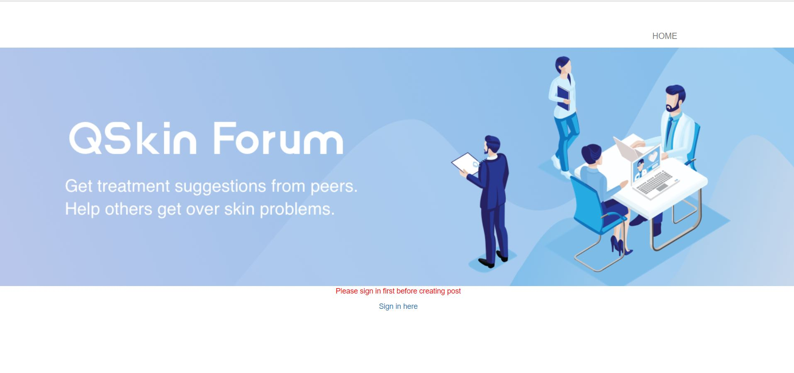
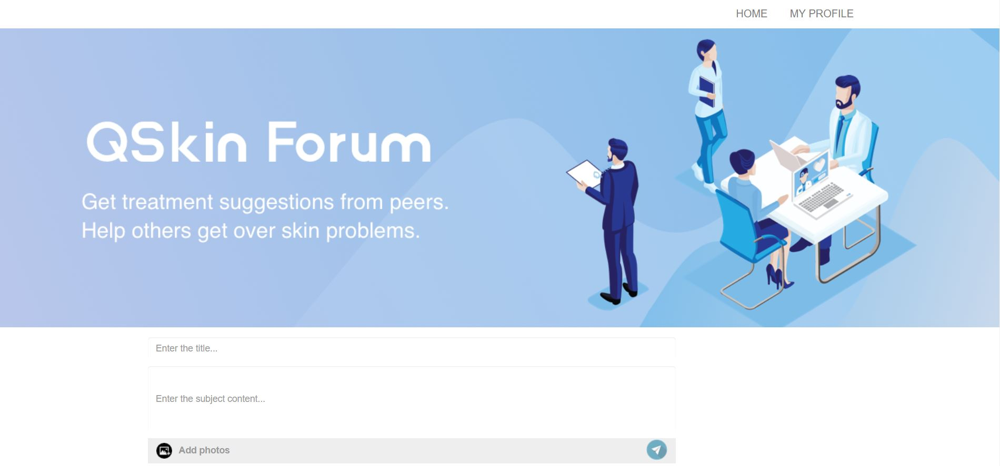
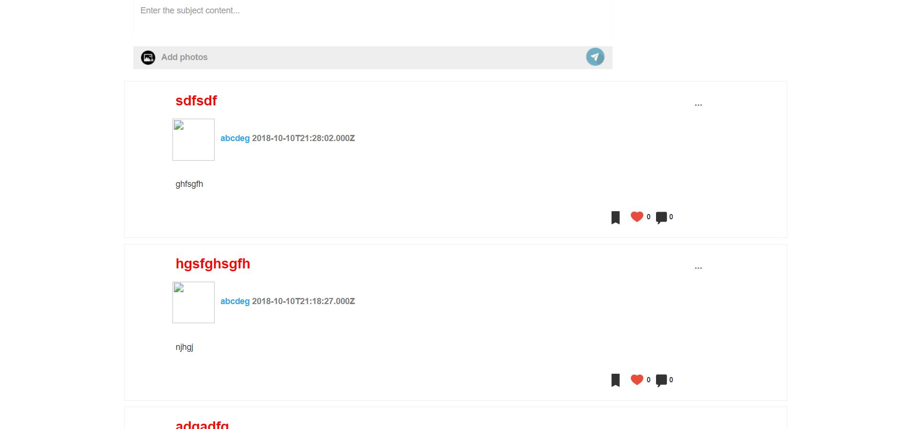

# qskin-project
The is a project I did for a full stack developer course along with other students using agile tool jira for collaboration and communication and git for version control.

There are functioning front and back end of the website built by reactjs and nodejs,mysql work bench is used for database.

This website is a forum based website where patient can post skin pictures to the website for dermatologist to diagnose.

Users are able to sign in, sign up, sign out, post a post with text or pictures or both, comment , reply to comment and like. Morover,user can change user name and password.

The skills and tools used in building the website are mysql, sequelize, javascript, reactjs, nodejs, redux state, css, html, mvc model

## Getting Started

These instructions will get you a copy of the project up and running on your local machine for development and testing purposes. See deployment for notes on how to deploy the project on a live system.

### Prerequisites

What things you need to install the software and how to install them

```
Task 1:install python 3.6+ from https://www.python.org/downloads/
Task 2:install nodejs lts version from https://nodejs.org/en/download/
Task 3:install visual studio code from https://code.visualstudio.com/Download
task 4:downlaod git https://git-scm.com/downloads
task 5: mysql workbench https://www.mysql.com/products/workbench/
```

### Installing

A step by step series of examples that tell you how to get a development env running

1.clone this repo and install all softwares above
2.open up both post and qskin folder and follow readme.md instruction there
This is what the website looks like:



## Running the tests

Go into both posts and qskin folder. All tests instructions are present there respectively.


